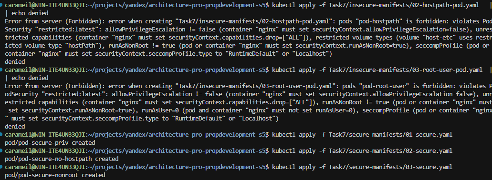

# architecture-pro-propdevelopment-s5

## Задание 1 — Классификация данных (ISO/IEC 27001/27002)

Шкала риска: «незначительный — значительный — критический». Полная карта в `Task1/data_security_mindmap.drawio`.

- **Публичные данные**: маркетинговый контент витрины продаж (до авторизации).
  - **Утечка**: незначительный — данные и так публичны.
  - **Потеря**: значительный — снижение продаж/SEO, недоступность информации.
  - **Искажение**: значительный — ущерб бренду, ввод пользователей в заблуждение.
  - **Некачественные данные**: значительный — неверные цены/описания.
  - **Обесценивание**: незначительный — низкая ценность по умолчанию.

- **Внутренние данные**: тех. документация и конфигурации (без секретов); операционные логи/метрики (без ПДн); внутренние отчёты без ПДн.
  - **Утечка**: значительный — упрощает атаки, раскрывает топологию/версии.
  - **Потеря**: значительный — ухудшает наблюдаемость/поддержку, растёт MTTR.
  - **Искажение**: значительный — ошибки конфигураций, простои.
  - **Некачественные данные**: значительный — шум/ложные срабатывания.
  - **Обесценивание**: незначительный.

- **Конфиденциальные данные**: ПДн клиентов/собственников (CRM, tenant‑core), данные и документы сделок (интеграции с госреестрами), платёжные токены/чеки (без PAN), копии ПДн в DWH.
  - **Утечка**: критический — штрафы 152‑ФЗ/GDPR, репутационные потери.
  - **Потеря**: значительный — срывы бизнес‑процессов/обслуживания.
  - **Искажение**: критический — мошенничество, неверные начисления/статусы.
  - **Некачественные данные**: значительный — ошибочные решения/счета.
  - **Обесценивание**: незначительный.

- **Секретные данные**: криптоключи и секреты (SMEV, PSP, БД, OAuth/TLS), учётные данные и хэши паролей (Keycloak, сервис‑аккаунты), идентификаторы повышенной чувствительности (паспорт/СНИЛС — при наличии).
  - **Утечка**: критический — компрометация систем/данных.
  - **Потеря**: критический — недоступность/невозможность расшифровки, простои.
  - **Искажение**: критический — MITM/подмена подписей/эскалация.
  - **Некачественные данные**: значительный — слабые ключи/пароли.
  - **Обесценивание**: незначительный.

Краткие обоснования указаны выше; расширенные пояснения и распределение по типам данных — в mind map.

## Задание 2 — Проверочный лист безопасности бизнес‑систем

Файл: `Task2/checklist.md`.

Включённые разделы (и почему):
- Идентификация и доступ, многотенантность: устранить утечки межпользовательских данных и IDOR.
- Безопасность данных, резервное копирование: защитить ПДн/сделки и обеспечить восстановление.
- Интеграции и API: закрыть риски партнёрских API (аутентификация, авторизация, минимизация данных, лимиты).
- Kubernetes/контейнеры: применить RBAC, NetworkPolicy, секреты, политики PodSecurity.
- Мониторинг/инциденты: централизованный аудит, SIEM, алерты.
- Соответствие (152‑ФЗ, PCI DSS), Data Governance: соблюдение законов и управление жизненным циклом данных.

## Задание 3 — Внешние интеграции (Умный дом)

Файлы в `Task3/`:
- `context_diagram.drawio` — диаграмма контекста C4 с новыми актёрами и системами.
- `updated_container_diagram.drawio` — расширенная диаграмма контейнеров с новыми компонентами.
- `security_requirements.md` — требования безопасности для интеграций.

Ключевые архитектурные решения:
- **Новые компоненты**: smart-home-integration сервис, API Gateway, Redis кэш для прав доступа.
- **Безопасность**: mTLS, OAuth 2.0, минимизация данных, изоляция тенантов.
- **Протоколы**: REST для управления, WebSocket для real-time событий, webhooks для асинхронных уведомлений.
- **Compliance**: соответствие 152-ФЗ, локализация биометрических данных, явные согласия.

## Задание 4 — Защита доступа к кластеру Kubernetes (RBAC)

Файлы в `Task4/`:
- `roles_authority.md` — таблица ролей, прав и групп пользователей.
- `03_create_users.sh` — создание ServiceAccounts и kubeconfig контекстов.
- `04_create_roles.sh` — создание Role и ClusterRole.
- `05_bind_users_to_roles.sh` — привязка пользователей к ролям.

### Архитектура RBAC:
- **Namespace по доменам**: sales, owners, data, finance, platform.
- **4 роли**: namespace-viewer (чтение), namespace-configurator (настройка без секретов), namespace-secret-viewer (доступ к секретам), cluster-readonly (кластерный обзор).
- **Принцип минимальных привилегий**: каждая роль имеет только необходимые права, без wildcards.

### Последовательность запуска:
```bash
# 1. Сделать скрипты исполняемыми
chmod +x Task4/*.sh

# 2. Создать пользователей и namespace
./Task4/03_create_users.sh

# 3. Создать роли
./Task4/04_create_roles.sh  

# 4. Привязать пользователей к ролям
./Task4/05_bind_users_to_roles.sh

# 5. Проверить RBAC (примеры команд в выводе скриптов)
```

## Задание 5 — Управление трафиком внутри кластера Kubernetes (NetworkPolicies)

Файл: `Task5/non-admin-api-allow.yaml` — сетевые политики для разграничения трафика.

### Архитектура сегментации:
- **Разрешённые пары**: front-end ↔ back-end-api, admin-front-end ↔ admin-back-end-api
- **Запрещено**: все остальные соединения (default deny)
- **Изоляция**: каждый сервис может общаться только со своей парой

### Последовательность запуска:
```bash
# 1. Развернуть 4 сервиса с метками ролей
kubectl run front-end-app --image=nginx --labels role=front-end --expose --port 80
kubectl run back-end-api-app --image=nginx --labels role=back-end-api --expose --port 80
kubectl run admin-front-end-app --image=nginx --labels role=admin-front-end --expose --port 80
kubectl run admin-back-end-api-app --image=nginx --labels role=admin-back-end-api --expose --port 80

# 2. Применить сетевые политики
kubectl apply -f Task5/non-admin-api-allow.yaml

# 3. Проверить развёртывание
kubectl get pods -o wide
kubectl get svc
kubectl get networkpolicies

# 4. Тестировать связность (разрешённые пары)
kubectl run test-frontend --rm -i -t --image=alpine --labels role=front-end -- sh
# В контейнере: wget -qO- --timeout=2 http://back-end-api-app

# 5. Тестировать изоляцию (запрещённые соединения)
kubectl run test-isolation --rm -i -t --image=alpine -- sh  
# В контейнере: wget -qO- --timeout=2 http://admin-back-end-api-app  # должно не работать
```

## Задание 6 — Аудит активности пользователей и обнаружение инцидентов

Примечание: скрипты, описанные в задании изменены на основе обсуждения в Пачке тут: https://app.pachca.com/chats/26366223?message=615699060

Файлы в `Task6/`:
- `audit-policy.yaml` — политика аудита API‑сервера
- `setup_minikube.sh` — старт Minikube с подключением политики аудита
- `simulate_security_incident_reworked.sh` — сценарий генерации событий (эмулирует инциденты)
- `collect_audit.sh` — сбор журнала аудита из pod `kube-apiserver`
- `filter_audit.sh` — быстрая фильтрация событий (jq)
- `analyze_audit.py` — анализатор; формирует `audit-extract.json` и `analysis.md`

### Последовательность запуска:
```bash
cd Task6
chmod +x setup_minikube.sh simulate_security_incident_reworked.sh filter_audit.sh collect_audit.sh

# 1) Запуск Minikube с включённым аудитом
./setup_minikube.sh

# 2) Симуляция инцидентов (генерирует события аудита)
bash simulate_security_incident_reworked.sh

# 3) Сбор журнала аудита API‑сервера в локальный файл
./collect_audit.sh audit.log

# 4a) Быстрая фильтрация (создаст JSON‑файлы в ./out/)
./filter_audit.sh audit.log out

# 4b) Полный анализ (создаст audit-extract.json и analysis.md)
python3 analyze_audit.py audit.log
```

### Ожидаемые артефакты:
- `Task6/audit.log` — журнал Kubernetes API audit
- `Task6/out/*.json` — выборки по категориям (secrets, exec, privileged pods, RBAC)
- `Task6/audit-extract.json` — агрегированный список подозрительных событий
- `Task6/analysis.md` — отчёт по шаблону из задания

Примечания:
- Требуются установленные `jq` и `python3`.
- По умолчанию лог пишется в stdout apiserver (`audit-log-path=-`) и собирается через `kubectl logs`.

## Задание 7 — Аудит и соответствие политике безопасности контейнеров (PodSecurity/OPA Gatekeeper)

Файлы в `Task7/`:
- `01-create-namespace.yaml` — namespace `audit-zone` с PodSecurity `restricted`
- `insecure-manifests/` — три небезопасных pod‑манифеста (privileged, hostPath, root)
- `secure-manifests/` — безопасные версии pod‑манифестов
- `gatekeeper/constraint-templates/*` и `gatekeeper/constraints/*` — шаблоны и правила Gatekeeper
- `verify/*.sh` — скрипты проверки

### Последовательность запуска:
```bash
# (Убедитесь, что Gatekeeper установлен; при наличии аддона)
# minikube addons enable gatekeeper
# (Если нет, то делаем):
# kubectl apply -f https://raw.githubusercontent.com/open-policy-agent/gatekeeper/release-3.17/deploy/gatekeeper.yaml
# kubectl -n gatekeeper-system rollout status deploy/gatekeeper-controller-manager --timeout=180s
# kubectl wait --for=condition=Established crd/constrainttemplates.templates.gatekeeper.sh --timeout=180s

# 1) Пространство имён с PodSecurity restricted
kubectl apply -f Task7/01-create-namespace.yaml

# 2) Политики Gatekeeper и валидация безопасных манифестов
chmod +x Task7/verify/*.sh
Task7/verify/validate-security.sh

# 3) Проверка отклонения небезопасных манифестов
Task7/verify/verify-admission.sh
```

Ожидаемо:
- Небезопасные pod’ы отклоняются Admission (PodSecurity/Gatekeeper)
- Безопасные pod’ы проходят валидацию


